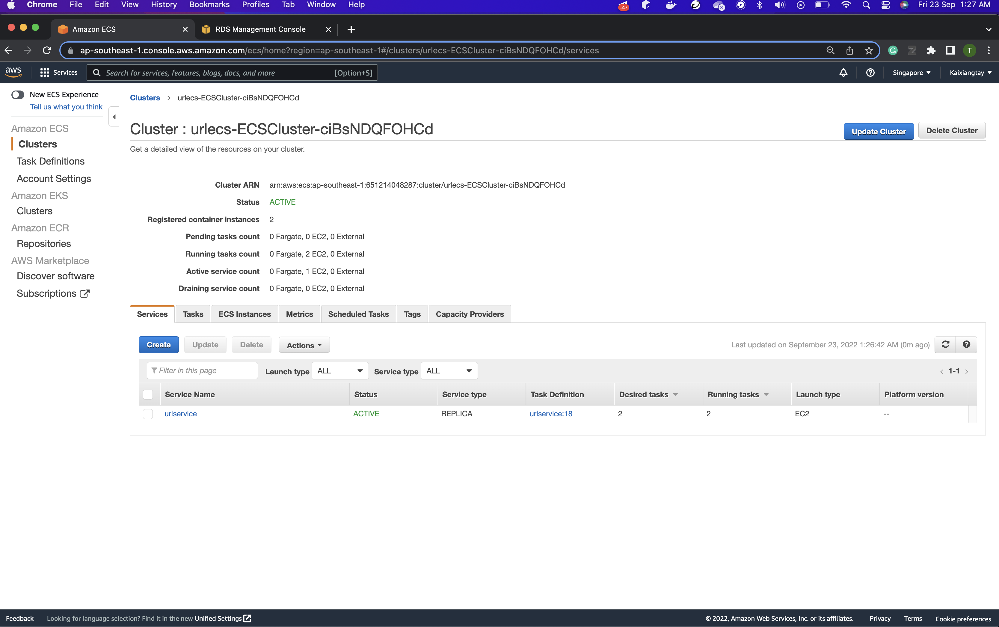
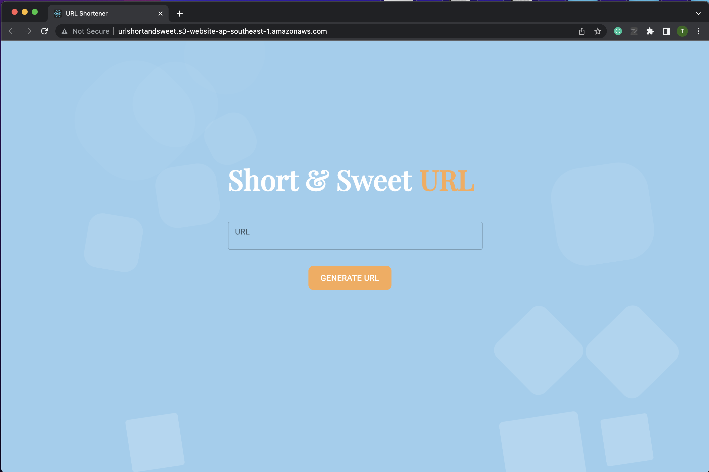

# UrlShortener

### Video of URL Shortener

**Click on above Thumbnail to view the URL Shortener Demo (Local Host) in YouTube**

- User will be able to type / paste in the URL and generate a shorten link
- User will be able to use the shorten link by clicking the link directly or open the link in a new tab
- User will be able to use the shorten link by copying the link and paste anywhere to share with anyone at any time

### Video of AWS CloudFormation + AWS ECR + AWS EC2 usage

**Click on above Thumbnail to view the resources used in YouTube**

- CloudFormation to deploy backend application AWS services automatically
- ECR to store docker images that are being built from development
- EC2 to create multiple instances with Load Balancer to distribute the traffic to the instances

### Video of AWS ECS + AWS RDS + JetBrains DataGrip

**Click on above Thumbnail to view the resources used in YouTube**

- AWS ECS is a cluster used to host multiple EC2 instances
- AWS RDS (MYSQL) is a database used to store data of URL shortener application in the cloud
- JetBrains DataGrip is used to view and verify the data stored inside AWS RDS

### Video of AWS S3 + Postman API testing + Mocha & Chai Automated Testing

**Click on above Thumbnail to view the resources used in YouTube**

- S3 is a Simple Storage Service used to host the frontend (client) React application in cloud
- Postman is used to perform API testing on backend application
- Automated testing is done mainly through mocha chai frameworks

### Tech Stack
- Frontend: React, Material UI
- Backend: NodeJS, Express, Sequelize (ORM for Database)
- Relational Database: AWS RDS (MySQL version)
- AWS: RDS, S3, CloudFormation, ECS, EC2, ECR
- Container: Docker
- Testing tools: Mocha, Chai, Postman
- Code Linter and Formatter: ESLint, Prettier

### Local Run
1.  Clone the repository folder Local

2. Create AWS RDS database and add in RDS credentials to .env file (template provided) 

3.  Inside the repository, execute following commands to deploy
    backend:
    - `cd local/backend/server`
    - `npm install`
    - `npm start`

4. Inside the repository, execute following commands to deploy
   frontend:
    - `cd local/frontend`
    - `npm install`
    - `npm start`
   

5. Inside the repository, execute following commands to run automated testing:
    - `cd local/backend/server`
    - `npm test`

### Cloud Run
1. Click this link [Short & Sweet Url](http://urlshortandsweet.s3-website-ap-southeast-1.amazonaws.com)

### Architecture Diagram

